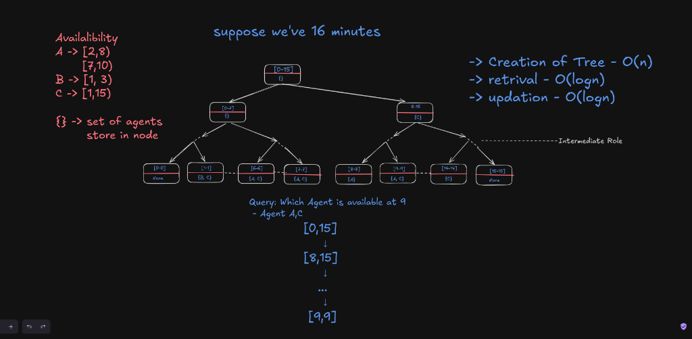
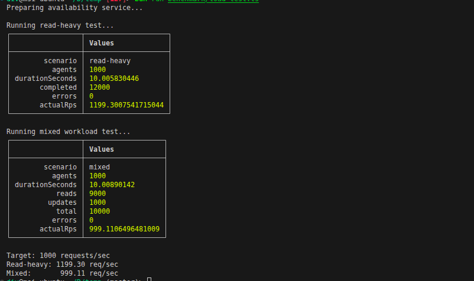

# Agent Availability Service

A high-performance, concurrent Agent Availability Service built with **Bun** and **TypeScript**. It leverages a **Segment Tree** for fast interval range queries across time windows (1,440 minutes/day) and an async **RWLock** primitive for thread-safe concurrent reads and writes.

---

## Features

- **Segment Tree Indexing**: Fast range updates and point queries for time-of-day availability windows.
- **Concurrent RWLock**: Async Reader-Writer lock allowing concurrent availability reads while serializing updates safely.
- **Agent & Window Management**: Add agents, remove agents, or update availability schedules dynamically.
- **High Throughput**: Handles ~1,200 req/sec in read-heavy workloads and ~1,000 req/sec in mixed workloads with zero errors across 1,000 agents.

---

## Approach

The service models time intervals (e.g., minutes of the day `[0, 1439]`) using a **Segment Tree** structure to allow fast retrieval and updates of available agents.

- **Tree Creation**: $O(N)$
- **Availability Retrieval**: $O(\log N)$
- **Schedule Update**: $O(\log N)$

Each node in the tree represents a time range and stores the set of active agents for that period. Point queries traverse down to specific minute leaf nodes (e.g., minute `9`) while aggregating agent sets along the path.



---

## Project Structure

```
├── src/
│   ├── availability-service.ts  # Main AvailabilityService class
│   ├── segment-tree.ts          # Segment Tree range query engine
│   ├── rw-lock.ts               # Reader-Writer Lock concurrency primitive
│   ├── time.ts                  # HH:MM time conversion utility
│   ├── models.ts                # TypeScript interfaces and types
│   └── index.ts                 # Quick demo script
├── test/                        # Unit and integration test suite
├── benchmark/
│   └── load-test.ts             # Load testing benchmark
└── assets/
    ├── approach-diagram.png     # Segment Tree availability approach diagram
    └── benchmark-results.png    # Benchmark result screenshot
```

---

## Getting Started

### Prerequisites

Ensure [Bun](https://bun.com) is installed on your system.

### Installation

```bash
bun install
```

### Running the Demo

```bash
bun run src/index.ts
```

---

## Testing & Benchmarking

### Run Test Suite

```bash
bun test
```

### Run Benchmark Load Test

```bash
bun run benchmark/load-test.ts
```

---

## Benchmark Results

The load test evaluates throughput (requests per second) for 1,000 agents under concurrent read-heavy and mixed read-write scenarios.

| Scenario | Agents | Duration | Completed Requests | Target RPS | Actual RPS | Errors |
| :--- | :---: | :---: | :---: | :---: | :---: | :---: |
| **Read-Heavy** | 1,000 | ~10s | 12,000 | 1,000 req/s | **1,199.30 req/s** | 0 |
| **Mixed Workload** | 1,000 | ~10s | 10,000 | 1,000 req/s | **999.11 req/s** | 0 |

### Terminal Benchmark Output


